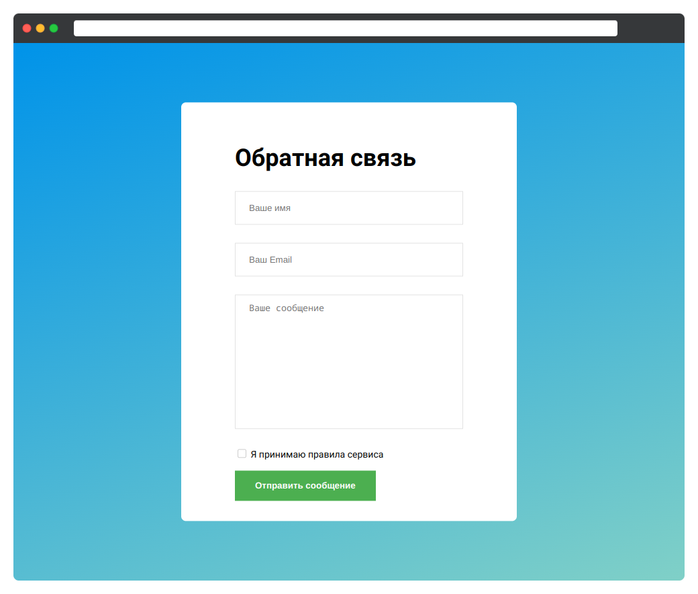

# Формы

Создайте форму обратной связи по макету ниже. Форма состоит из пяти основных элементов:

- Два текстовых поля для ввода имени и email.
- Поле для ввода сообщения.
- Чекбокс с принятием условий сервиса.
- Кнопка отправки сообщения.



## 8-forms.html

- Заголовок первого уровня внутри формы: «Обратная связь».
- Каждое текстовое поле формы лежит в обёртке с классом `.form-input`. Отступ снизу от каждой обёртки создаётся с помощью класса `mb-2`. Для каждого текстового поля обязательно наличие `label`, который будет скрыт с помощью класса `sr-only`. Его реализация уже находится в файле _8-forms.css_.
- Чекбокс с принятием условий сервиса имеет обёртку с классами `small` и `mb-1`.

**Обёртка** (**контейнер**) — блок, внутри которого лежат элементы. Таким блоком зачастую является `<div>` или `<section>`. Например,

```html
<div class="container">
  <p>Параграф 1</p>
  <p>Параграф 2</p>
  <p>Параграф 3</p>
  <p>Параграф 4</p>
</div>
```

Для параграфов элемент с классом `container` будет являться обёрткой или контейнером.

## Описание полей

Для элементов `input` (кроме чекбокса) и `textarea` добавьте описания через атрибут `placeholder`.

- Ваше имя.
- Ваш Email.
- Ваше сообщение.

## 8-forms.css

Реализуйте стили `form-input` по следующему ТЗ.

- Все дочерние элементы внутри класса `form-input` должны иметь блочное отображение и иметь ширину в 100 %.
- Текстовые поля имеют высоту 50 пикселей с внутренними отступами в 10 пикселей по вертикали и 20 пикселей по горизонтали. Для сохранения размеров измените поведение блочной модели с помощью свойства `box-sizing` со значением `border-box`. Поля имеют сплошную границу в 1 пиксель и цветом `#e2e2e2`.
- Поле для ввода сообщения имеет высоту 200 пикселей. Запретите пользователю управлять размерами этого поля.

## Подсказки

Для выбора всех потомков в CSS используется селектор `*`. Например, конструкция:

```css
.block * {
  color: white;
}
```

установит белый цвет для всех элементов, которые вложены в блок с классом `.block`.

Селектор так же можно использовать в комбинации с другими, например `>`, тогда конструкция

```css
.block > * {
  color: white;
}
```

установит белый цвет для всех элементов, которые лежат непосредственно в `.block`, то есть являются прямыми потомками.
