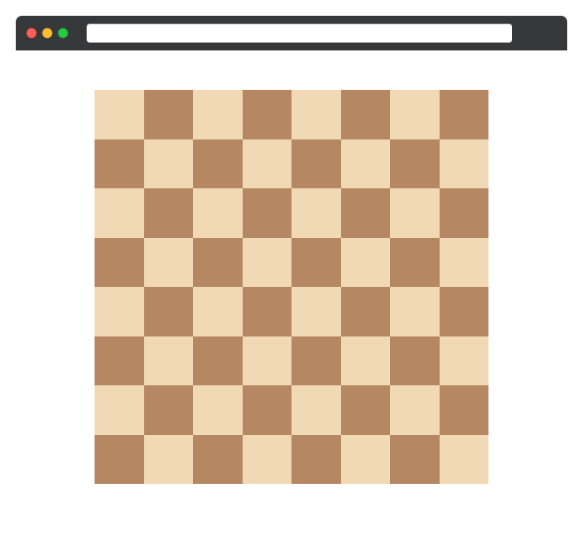

# Псевдоклассы

В этом задании, используя изученные псевдоклассы, вам предстоит создать поля шахматной доски

Вёрстка и основные стили шахматной доски уже доступны в соответствующих файлах. Осталось только покрасить необходимые клетки в светлый цвет `#f1d9b5`.
