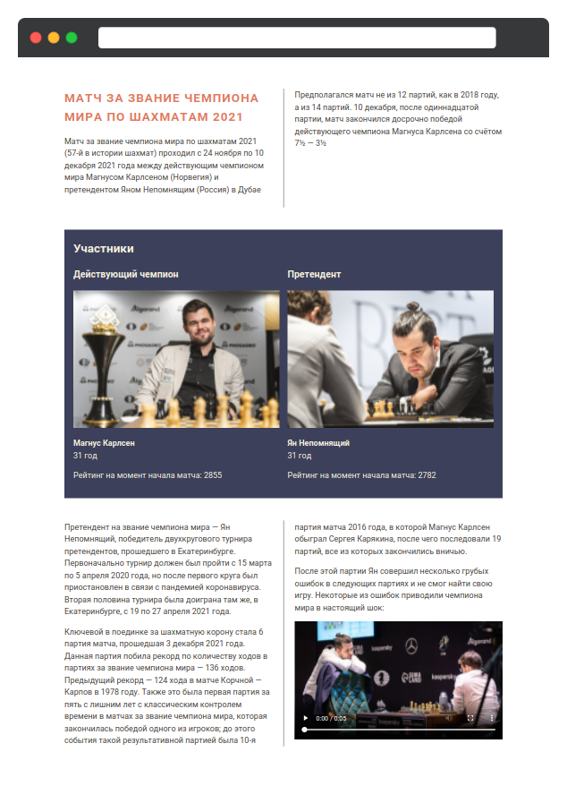

# Медиаэлементы

В этом задании мы снова вернёмся к шахматной тематике, но теперь узнаем о матче, прошедшем в 2021 году между чемпионом Магнусом Карлсеном и Яном Непомнящим. В этот раз уже готовы все необходимые стили, а ваша задача — добавить блоки с претендентами и вставить видео в конце текстовой части обзора

## 6-media.html

Добавьте два блока для описания играющих шахматистов. Структура полностью совпадает с той, что была в задании про колонки:

- Статус: _Действующий чемпион_ или _Претендент_
- Фотография
- Имя
- Возраст
- Рейтинг на момент начала матча

### Магнус Карлсен

- Статус: _Действующий чемпион_
- Фотография: _./assets/images/magnus_2021.jpg_
- Возраст: 31 год
- Рейтинг на момент начала матча: 2855

### Ян Непомнящий

- Статус: _Претендент_
- Фотография: _./assets/images/nepomniachtchi_2021.jpg_
- Возраст: 31 год
- Рейтинг на момент начала матча: 2782

Блок с участником имеет следующие классы и теги:

- Для блоков описания используется общий класс `member` и внутри каждого:
  - Заголовок третьего уровня со статусом.
  - Изображение.
  - Параграф с именем. Используйте класс `member-name`.
  - Параграф с возрастом.
  - Параграф с рейтингом.

### Видео

В конце добавьте видео, которое находится по пути: _./assets/magnus-after-mistake.mp4_. Добавьте к нему класс `w-100` — это поможет задать правильные размеры для видео, чтобы оно не выходило за рамки колонки. У видео должны быть доступны элементы управления. В качестве превью для видео используйте изображение по адресу _./assets/images/poster.jpg_.
