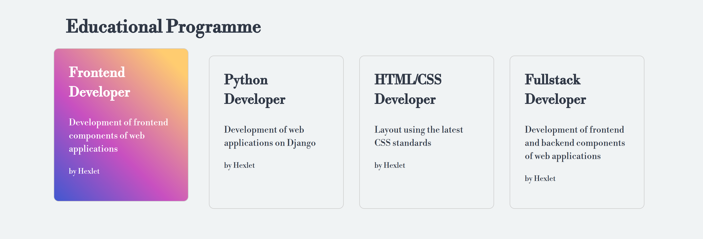

# Относительное позиционирование

Доработайте стили при наведении курсора мыши на карточку товара. Прошлый разработчик реализовал смену цвета, но совершенно не знает, как сдвинуть карточку при событии `:hover`. Результатом выполнения задания станет следующий макет:

У всех карточек есть свойство `transition`, которое обеспечивает плавное изменение свойств. Чтобы при наведении на карточку положение тоже менялось плавно, необходимо сделать несколько вещей:

1. Указать свойства расположения до того, как оно будет меняться.
2. Изменять только необходимые свойства при событии `:hover`.

Используя эти инструкции допишите необходимые свойства и расположите карточку следующим образом при наведении на неё курсора мыши:

- На 15 пикселей выше начального положения.
- На 10 пикселей левее начального положения.

## Подсказки

Для элемента `card` установите позиционирование и начальные координаты `0` у свойств, которые будут меняться при использовании `:hover`. Таким образом позиционирование и нулевые координаты будут установлены у `card`, а при hover будут меняться только значения координат. Это делается для плавной анимации с использованием свойства `transition`.
