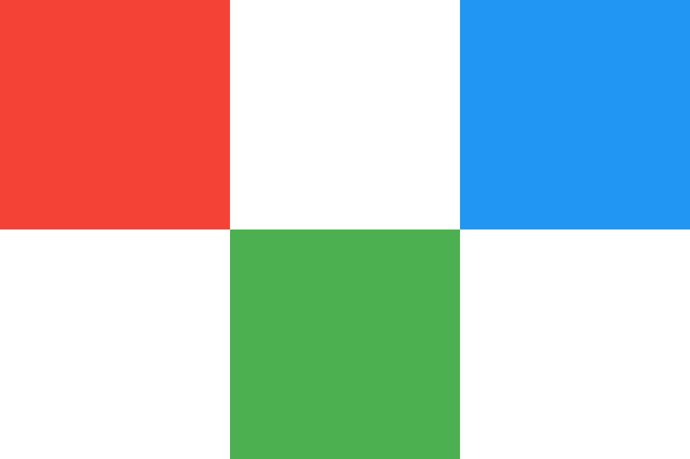

# Абсолютное позиционирование

Расположите 3 квадрата следующим образом:

Все цвета квадратов и размеры даны в виде переменных в файле _2-absolute.css_. Перед позиционированием разместите все квадраты по координатам _0, 0_. Используйте только изученные средства абсолютного позиционирования.

Классы:

- `square-red` — красный квадрат.
- `square-green` — зелёный квадрат.
- `square-blue` — синий квадрат.

## Подсказки

- Для расчётов можно использовать функцию `calc` и значение переменной `--side`, например `calc(var(--side) \* 5)`. Эта строка вернёт значение переменной `--side`, умноженной на 5.
- Для создания квадратов используйте свойства `width` и `height`.
- Стороны квадрата фиксированы и не должны изменяться. Ширина стороны находится в переменной `--side`.
