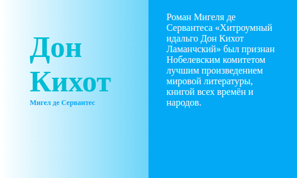

# Относительное и абсолютное позиционирование

В данном задании стоит задача доделать карточку с описанием книги. Необходимо при наведении курсора мыши на карточку показывать её описание. Прошлый сотрудник сделал всю необходимую вёрстку, но не смог расположить описание там, где это необходимо.

## 3-relative-and-absolute.css

Используя комбинацию относительного и абсолютного позиционирования, сделайте так, чтобы при наведении на карточку описание располагалось следующим образом:

Для этого необходимо:

1. Используя необходимые правила, расположить блок справа.
2. Задать блоку с описанием высоту в 100%. Решите этот вопрос, используя комбинацию `top` и `bottom`.
