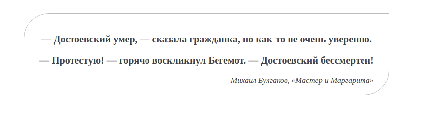

# Основы CSS

Оформление текстового содержания — одна из самых частых задач для верстальщика. Недостаточно просто расставить блоки и добавить им стили. Помимо этого необходимо задать стили тексту так, чтобы он комфортно читался.

Оформите текстовое содержание цитаты. Некоторые стили для неё уже существуют. Ваша задача — работа с текстом. Для этого в HTML-разметке цитаты есть два класса: `quote` и `quote-author`. Откройте файл 3-css-intro.html и посмотрите на текущую вёрстку.

## Задание

Оформите текст по следующим правилам:

- Для класса quote установите правила:

  - Цвет текста: #404040.
  - Жирное начертание шрифта. Используйте словесное описание в значении. Для этого воспользуйтесь свойством `font-weight` со значением `bold`.
  - Размер текста: `20px`.
  - Выравнивание текста по центру.

- Для класса quote-author установите правила:
  - Нормальное начертание шрифта. Используйте словесное описание в значении. Для этого воспользуйтесь свойством `font-weight` со значением `normal`.
  - Размер текста: `16px`.
  - Выравнивание текста по правому краю.
