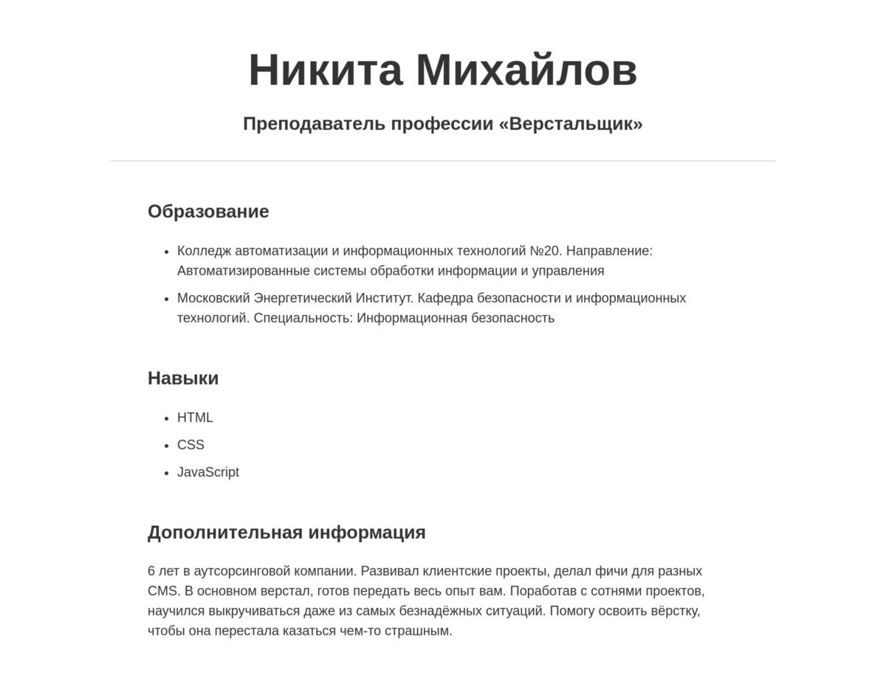

# Каскадность в CSS

Каждый верстальщик рано или поздно делает страницу «О себе». Часто её дизайн достаточно сложен, чтобы показать свои возможности. Такие страницы похожи на портфолио художника.

Всё большое, как известно, начинается с малого. В этом упражнении вы сделаете свою первую страницу «О себе» и разберётесь с принципами каскадности, которые были описаны в этом уроке.

Ваша страница будет иметь примерно следующий вид:

## HTML-разметка

Добавьте следующие элементы в HTML-разметку:

- Заголовок h1 и h2. В заголовке первого уровня напишите как вас зовут. В заголовке второго уровня укажите вашу должность.
- Три секции `section`:
  - Первая секция рассказывает о вашем образовании.
  - Вторая секция рассказывает о ваших навыках.
  - Третья секция служит для различной дополнительной информации о вас. Здесь может быть всё что угодно.

Каждая секция обязательно содержит заголовок второго уровня. Так же, в первых двух секциях должен присутствовать маркированный список.

В разметке не используются классы или идентификаторы. Все стилистические изменения будут производиться с помощью селекторов по тегам. Это не всегда хорошо в реальной работе, но так проще понять принцип каскадности.

## CSS-стили

Общие стили для body:

- Размер текста: 18 пикселей
- Цвет текста: #333

Стили для заголовка h1:

- Внешний отступ сверху: 50 пикселей
- Внешний отступ снизу: 10 пикселей
- Размер текста: 60 пикселей
- Выравнивание текста: по центру

Стили для заголовка h2:

- Внешний отступ сверху: 0 пикселей
- Внутренний отступ снизу: 30 пикселей
- Размер текста: 25 пикселей
- Выравнивание текста: по центру

Стили для секций:

- Внешние отступы: по 50 пикселей сверху и снизу. 0 пикселей слева и справа.
- Внутренние отступы: по 50 пикселей слева и справа. 0 пикселей сверху и снизу/

Стили для заголовков внутри секций:

- Внутренние отступы: 0 пикселей
- Выравнивание текста: по левому краю
- Граница отсутствует

Стили для элементов списка:

- Внешний отступ снизу: 10 пикселей

## Используемые свойства

В этом задании вам понадобятся внутренние/внешние отступы. Используйте следующие свойства:

- `margin-top`, `margin-bottom`, `margin-left`, `margin-right` для установки внешних отступов.
- `padding-top`, `padding-bottom`, `padding-left`, `padding-right` для установки внутренних отступов.

Подробное описание работы этих свойств будет в теме «Основы вёрстки контента».

## Подсказки

- При значении 0 у свойства не указывается единица измерения.
- Для отмены границы используйте свойство `border` со значением `none`.
- Используйте вложенные селекторы.
