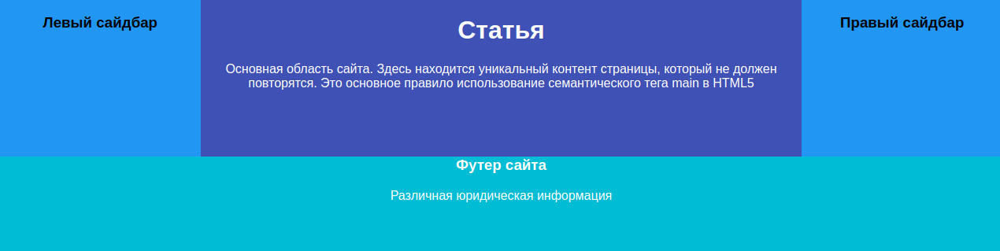

# Плавающие элементы

Используя технику «старых мастеров», создайте типичный трёхколоночный макет. Вёрстка доступна в файле _5-float.html_. Ваша задача — используя свойства `float` и `clear`, сделать необходимый макет.

## 5-float.css

В файле _5-float.css_ уже созданы некоторые стили для блоков. Допишите необходимые стили. Не забывайте, что у многих блоков возможно наличие свойства `float`.

## Подсказки

Используйте одинаковое значение для всех свойств `float`.
